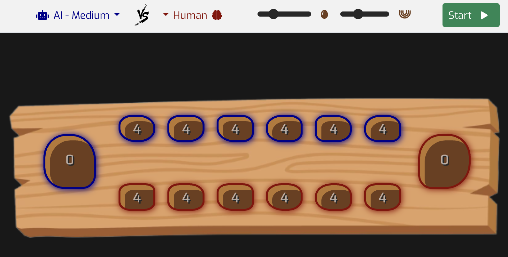

# Mancala



Yet another game-oriented-artificial-intelligence-fun-and-studying-project

These were the mains goals behind it:

- [Learn mancala](https://en.wikipedia.org/wiki/Mancala)
- [Study webworkers](https://developer.mozilla.org/en-US/docs/Web/API/Web_Workers_API/Using_web_workers)
- [Study minimax](https://en.wikipedia.org/wiki/Minimax)
- Have fun. Yay.

If you want to, you can play with your friends or/and defy the AI. I should warn you, it's not a good idea.

[Play it here](https://virgs.github.io/mancala/)

## Mancala

[Mancala](https://github.com/virgs/mancala/blob/main/src/engine/MancalaEngine.ts#L49) (Arabic: منقلة manqalah) refers to a family of two-player turn-based strategy board games played with small stones, beans, or seeds and rows of holes or pits in the earth, a board or other playing surface. The objective is usually to capture all or some set of the opponent's pieces.

Versions of the game date back past the 3rd century and evidence suggests the game existed in Ancient Egypt. It is among the oldest known games to still be widely played today.

## Webworker

[Web Workers](https://github.com/virgs/mancala/blob/main/src/engine/ai/AiWorker.ts) are a simple means for web content to run scripts in background threads. The worker thread can perform tasks without interfering with the user interface. Once created, a worker can send messages to the JavaScript code that created it by posting messages to an event handler specified by that code (and vice versa).  
This is where the AI CPU heavier usage takes place.

## AI

It uses [Minimax](https://github.com/virgs/mancala/blob/main/src/engine/ai/Minimax.ts) as artificial intelligence.

Minmax (sometimes Minimax, MM or saddle point) is a decision rule used in artificial intelligence, decision theory, game theory, statistics, and philosophy for minimizing the possible loss for a worst case (maximum loss) scenario. When dealing with gains, it is referred to as "maximin" – to maximize the minimum gain. Originally formulated for several-player zero-sum game theory, covering both the cases where players take alternate moves and those where they make simultaneous moves, it has also been extended to more complex games and to general decision-making in the presence of uncertainty.

### AI levels

The level of difficulty is pre-determined by how deep the AI tree can be explored. The shallower, the stupider the AI gets.
Setting the non-easy levels can get a bit tricky because different factors come to play:

- It cannot be too dificult
- It cannot be too easy
- It can't take too long to explore all leaves
  - Heavily based on target users devices.
  
Note that depending on where you're playing it, skilled and anxious you are, you can have a completely different experience.
A small last disclaimer, if you are too anxious, look for medical treatment.

With no further ado, [I have defined](https://github.com/virgs/mancala/blob/main/src/engine/ai/Minimax.ts#L22):

- **Easy**: 0 depth tree
- **Medium**: 2 depth tree
- **Hard**: 9 depth tree

Tweak these numbers around if you disagree with the ones I came up with. Go crazy.

This is how you would do it

### Project Setup

```sh
npm install
```

#### Compile and Hot-Reload for Development

```sh
npm run dev
```

#### Type-Check, Compile and Minify for Production

```sh
npm run build
```

#### Format

```sh
npm run format
```
